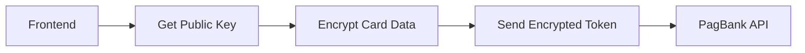
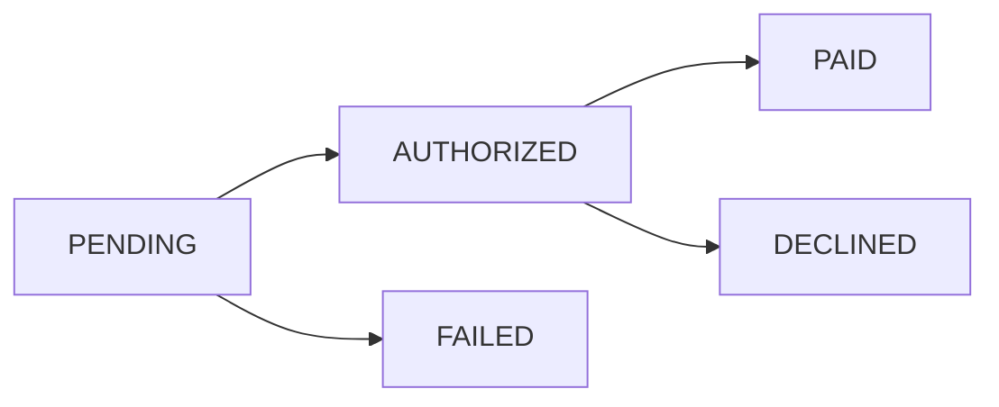
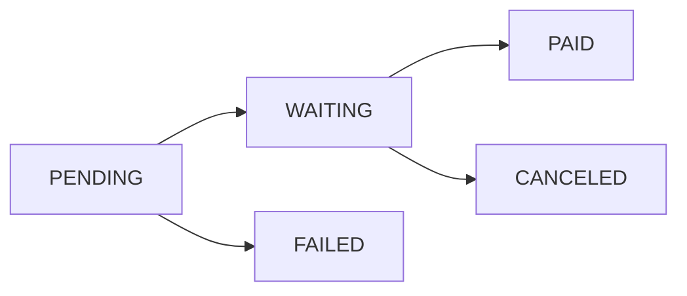

# PagBank Combined Payment Flows: Credit Card & PIX

## Overview

This document provides a comprehensive flowchart showing both credit card and PIX payment processes in the PagBank integration, highlighting the shared components and unique aspects of each payment method.

## Combined Payment Flow Overview

```mermaid
flowchart TD
    A[Frontend Application] --> B{Payment Method Selection}
    
    B -->|Credit Card| C[Credit Card Flow]
    B -->|PIX| D[PIX Flow]
    
    %% Shared Initial Steps
    C --> E[Get Public Key]
    D --> F[Create Payment Request]
    
    E --> G[PagBankPublicKeysView.get]
    G --> H[PagBankClient.get_public_key]
    H --> I{Public Key Exists?}
    
    I -->|No| J[PagBankClient.create_public_key]
    I -->|Yes| K[PagBankPublicKey.valid_objects]
    
    J --> L[POST /public-keys]
    L --> M[PagBankPublicKeyManager.create_from_api_response_data]
    M --> N[Return Public Key]
    K --> N
    
    N --> O[PagBankPublicKeySerializer]
    O --> P[Frontend Receives Key]
    
    P --> Q[User Enters Card Data]
    Q --> R[Frontend Encrypts Card]
    R --> S[Create Payment Request]
    
    %% Shared Order Creation
    F --> S
    S --> T[Payment Processing View/API]
    T --> U[Create Customer Model]
    U --> V[Customer.objects.create]
    
    V --> W[Create Phone Model]
    W --> X[Phone.objects.create]
    
    X --> Y[Create Address Model]
    Y --> Z[Address.objects.create]
    
    Z --> AA[Create Order Model]
    AA --> BB[Order.objects.create]
    
    BB --> CC[Create OrderItem Model]
    CC --> DD[OrderItem.objects.create]
    
    DD --> EE[Create OrderCharge Model]
    EE --> FF[OrderCharge.objects.create]
    
    FF --> GG[Create OrderChargePaymentMethod]
    GG --> HH[OrderChargePaymentMethod.objects.create]
    
    %% Payment Method Specific Creation
    HH --> II{Payment Type?}
    
    II -->|CREDIT_CARD| JJ[Create OrderChargePaymentMethodCard]
    II -->|PIX| KK[Create OrderChargePaymentMethodPIX]
    
    JJ --> LL[OrderChargePaymentMethodCard.objects.create]
    KK --> MM[OrderChargePaymentMethodPIX.objects.create]
    
    %% PIX Specific: QR Code Creation
    MM --> NN[Create OrderQRCode Model]
    NN --> OO[OrderQRCode.objects.create]
    
    %% Shared: Splits Creation
    LL --> PP[Create OrderSplit if needed]
    OO --> PP
    PP --> QQ[OrderSplit.objects.create]
    
    %% Payment Processing Branch
    QQ --> RR{Payment Method?}
    
    RR -->|CREDIT_CARD| SS[PagBankClient.create_credit_card_order]
    RR -->|PIX| TT[PagBankClient.create_pix_order]
    
    %% Credit Card Serialization Chain
    SS --> UU[PagBankOrderSerializer.__init__]
    UU --> VV[PagBankOrderCustomerSerializer]
    VV --> WW[PagBankOrderCustomerPhoneSerializer]
    WW --> XX[PagBankOrderItemSerializer]
    XX --> YY[PagBankChargeSerializer]
    YY --> ZZ[PagBankChargeCreditCardPaymentMethodSerializer]
    ZZ --> AAA[PagBankSplitReceiverSerializer]
    
    %% PIX Serialization Chain
    TT --> BBB[PagBankPixOrderSerializer.__init__]
    BBB --> CCC[PagBankOrderCustomerSerializer]
    CCC --> DDD[PagBankOrderCustomerPhoneSerializer]
    DDD --> EEE[PagBankOrderItemSerializer]
    EEE --> FFF[PagBankQRCodeSerializer]
    FFF --> GGG[PagBankSplitReceiverSerializer]
    
    %% Shared API Call
    AAA --> HHH[Serialize Order Data]
    GGG --> HHH
    HHH --> III[POST /orders to PagBank API]
    
    III --> JJJ{API Response OK?}
    
    JJJ -->|No| KKK[Handle API Error]
    KKK --> LLL[PaymentGatewayClientRequestFailedError]
    LLL --> MMM[Log Error]
    MMM --> NNN[Return Error Response]
    
    %% Response Processing Branch
    JJJ -->|Yes| OOO{Payment Method?}
    
    OOO -->|CREDIT_CARD| PPP[PagBankOrderCreditCardPaymentResponseSerializer]
    OOO -->|PIX| QQQ[PagBankPixOrderResponseSerializer]
    
    %% Credit Card Response Processing
    PPP --> RRR[Validate Response Data]
    RRR --> SSS[Update Order.external_id]
    SSS --> TTT[Update OrderCharge.external_id]
    TTT --> UUU[Update OrderCharge.status]
    UUU --> VVV[PagBankCardDataCreditCardPaymentResponseSerializer]
    VVV --> WWW[Update Card Information]
    WWW --> XXX[Update Trip Contract Charge]
    XXX --> YYY[Set TripContractCharge.status = PAID]
    
    %% PIX Response Processing
    QQQ --> ZZZ[Validate Response Data]
    ZZZ --> AAAA[Update Order.external_id]
    AAAA --> BBBB[Update OrderQRCode.external_id]
    BBBB --> CCCC[Update OrderQRCode.text]
    CCCC --> DDDD[Update OrderQRCode.png_link]
    DDDD --> EEEE[Update OrderQRCode.base64_link]
    
    %% Shared Success Response
    YYY --> FFFF[Return Success Response]
    EEEE --> FFFF
    
    %% Frontend Response Branch
    FFFF --> GGGG{Payment Method?}
    
    GGGG -->|CREDIT_CARD| HHHH[Frontend Shows Success]
    GGGG -->|PIX| IIII[Frontend Shows QR Code]
    
    %% PIX User Interaction
    IIII --> JJJJ[User Scans QR Code]
    JJJJ --> KKKK[User Pays via PIX App]
    
    %% Shared Webhook Processing
    HHHH --> LLLL[PagBank Webhook Trigger]
    KKKK --> LLLL
    
    LLLL --> MMMM[POST /webhooks/orders/]
    MMMM --> NNNN[PagBankOrderWebHook.post]
    
    NNNN --> OOOO{Environment = Production?}
    OOOO -->|Yes| PPPP[PagBankTokenAuthentication.authenticate]
    OOOO -->|No| QQQQ[Skip Authentication]
    
    PPPP --> RRRR[Extract X-Authenticity-Token]
    RRRR --> SSSS[generate_signature]
    SSSS --> TTTT{Signature Valid?}
    
    TTTT -->|No| UUUU[AuthenticationFailed]
    UUUU --> VVVV[Return 401 Unauthorized]
    
    TTTT -->|Yes| WWWW[Get Order by external_id]
    QQQQ --> WWWW
    
    %% Webhook Processing Branch
    WWWW --> XXXX{Payment Method?}
    
    XXXX -->|CREDIT_CARD| YYYY[PagBankClient.update_credit_card_order]
    XXXX -->|PIX| ZZZZ[PagBankClient.update_pix_order]
    
    %% Shared Webhook Serialization
    YYYY --> AAAAA[PagBankOrderWebhookSerializer]
    ZZZZ --> AAAAA
    
    AAAAA --> BBBBB[PagBankChargeWebhookSerializer]
    BBBBB --> CCCCC{Payment Method?}
    
    CCCCC -->|CREDIT_CARD| DDDDD[PagBankPaymentMethodSerializer]
    CCCCC -->|PIX| EEEEE[PagBankPaymentMethodSerializer]
    
    DDDDD --> FFFFF[PagBankCardDataCreditCardPaymentResponseSerializer]
    EEEEE --> GGGGG[PagBankPixSerializer]
    
    %% Shared Validation and Processing
    FFFFF --> HHHHH[Validate Webhook Data]
    GGGGG --> HHHHH
    
    HHHHH --> IIIII{Validation OK?}
    IIIII -->|No| JJJJJ[ValidationError]
    JJJJJ --> KKKKK[Return 400 Bad Request]
    
    IIIII -->|Yes| LLLLL[Update OrderCharge Status]
    LLLLL --> MMMMM[Create/Update Payment Method]
    MMMMM --> NNNNN{Payment Method?}
    
    NNNNN -->|CREDIT_CARD| OOOOO[Update Card Information]
    NNNNN -->|PIX| PPPPP[Create/Update PIX Information]
    
    OOOOO --> QQQQQ[Link to Trip Contract Charge]
    PPPPP --> QQQQQ
    
    QQQQQ --> RRRRR[Update Trip Status]
    RRRRR --> SSSSS[Send Email Notification]
    SSSSS --> TTTTT[send_email_with_payment_status_update.delay]
    TTTTT --> UUUUU[Return 204 No Content]
    
    UUUUU --> VVVVV[Payment Flow Complete]
```



## Detailed Comparison of Payment Methods

### Shared Components

#### 1. Order Creation Phase
Both payment methods follow the same initial order creation process:

```python
# Shared Models (Both Credit Card and PIX)
Customer.objects.create(...)
Phone.objects.create(...)
Address.objects.create(...)
Order.objects.create(...)
OrderItem.objects.create(...)
OrderCharge.objects.create(...)
OrderChargePaymentMethod.objects.create(...)
OrderSplit.objects.create(...)  # If marketplace
```

#### 2. Common Serializers
- **`PagBankOrderCustomerSerializer`**: Customer data serialization
- **`PagBankOrderCustomerPhoneSerializer`**: Phone data serialization
- **`PagBankOrderItemSerializer`**: Order items serialization
- **`PagBankSplitReceiverSerializer`**: Revenue splits serialization

#### 3. Shared Webhook Processing
- **`PagBankOrderWebHook`**: Common webhook endpoint
- **`PagBankOrderWebhookSerializer`**: Order webhook processing
- **`PagBankChargeWebhookSerializer`**: Charge webhook processing
- **`PagBankTokenAuthentication`**: Webhook authentication

### Credit Card Specific Components

#### 1. Public Key Management
```python
# Credit Card Only
PagBankPublicKeysView.get()
PagBankClient.get_public_key()
PagBankPublicKeyManager.create_from_api_response_data()
PagBankPublicKeySerializer()
```

#### 2. Card-Specific Models
```python
# Credit Card Only
OrderChargePaymentMethodCard.objects.create(
    payment_method=payment_method,
    card_token="encrypted_token_from_frontend"
)
```

#### 3. Card-Specific Serializers
```python
# Credit Card Only
PagBankChargeCreditCardPaymentMethodSerializer()
PagBankCardDataCreditCardPaymentResponseSerializer()
PagBankOrderCreditCardPaymentResponseSerializer()
```

#### 4. Card Encryption Flow


### PIX Specific Components

#### 1. QR Code Management
```python
# PIX Only
OrderQRCode.objects.create(
    order=order,
    amount=10000,
    expiration=timezone.now() + timedelta(minutes=30)
)
```

#### 2. PIX-Specific Models
```python
# PIX Only
OrderChargePaymentMethodPIX.objects.create(
    payment_method=payment_method,
    holder_name="João Silva",
    holder_document="12345678901"
)
```

#### 3. PIX-Specific Serializers
```python
# PIX Only
PagBankPixOrderSerializer()
PagBankQRCodeSerializer()
PagBankPixOrderResponseSerializer()
PagBankPixSerializer()
```

#### 4. QR Code Generation Flow


## Payment Method Comparison Table

| Aspect | Credit Card | PIX |
|--------|-------------|-----|
| **Authentication** | Public key encryption required | No encryption needed |
| **User Interaction** | Enter card details | Scan QR code |
| **Payment Timing** | Immediate processing | User-initiated via PIX app |
| **QR Code** | Not applicable | Required for payment |
| **Card Information** | Encrypted token storage | Not applicable |
| **PIX Holder Info** | Not applicable | Optional storage |
| **Payment Confirmation** | Immediate via API response | Via webhook after user payment |
| **Expiration** | Card expiration date | QR code expiration (30 min) |
| **Security** | PCI compliance required | Lower security requirements |

## API Endpoint Comparison

### Credit Card Endpoints
```python
# Public Key Management
GET /public-keys/  # Get encryption key
POST /public-keys/  # Create new key

# Order Creation
POST /orders/  # Create credit card order
```

### PIX Endpoints
```python
# Order Creation
POST /orders/  # Create PIX order with QR codes

# QR Code Management
GET /qr-codes/{id}/png  # Get QR code image
GET /qr-codes/{id}/base64  # Get QR code base64
```

### Shared Endpoints
```python
# Webhook Processing
POST /webhooks/orders/  # Payment status updates

# Order Management
GET /orders/{id}  # Get order details
```

## Error Handling Comparison

### Credit Card Errors
```python
# Common Credit Card Errors
- Card declined
- Insufficient funds
- Invalid card number
- Expired card
- CVV mismatch
- 3D Secure authentication required
```

### PIX Errors
```python
# Common PIX Errors
- QR code expired
- Invalid PIX key
- Payment timeout
- Insufficient funds
- PIX account not found
```

### Shared Errors
```python
# Common to Both Methods
- API authentication failure
- Invalid order data
- Network timeout
- Server errors
- Validation errors
```

## Status Flow Comparison

### Credit Card Status Flow


### PIX Status Flow


## Database Schema Comparison

### Credit Card Tables
```sql
-- Credit Card Specific
order_charge_payment_method_card
├── payment_method_id (FK)
├── card_token (encrypted)
├── brand
├── first_digits
├── last_digits
├── exp_month
├── exp_year
├── holder_name
└── holder_document

-- Public Key Management
pagbank_public_key
├── key
├── created_at
└── expires_at
```

### PIX Tables
```sql
-- PIX Specific
order_charge_payment_method_pix
├── payment_method_id (FK)
├── holder_name
└── holder_document

-- QR Code Management
order_qr_code
├── order_id (FK)
├── external_id
├── amount
├── expiration
├── text
├── png_link
└── base64_link
```

### Shared Tables
```sql
-- Shared by Both Methods
customer
phone
address
order
order_item
order_charge
order_charge_payment_method
order_split
```

## Performance Considerations

### Credit Card Performance
- **API Calls**: 2-3 calls per transaction
- **Processing Time**: Immediate (seconds)
- **Success Rate**: Depends on card validation
- **Retry Logic**: Limited retry attempts

### PIX Performance
- **API Calls**: 1-2 calls per transaction
- **Processing Time**: User-dependent (minutes)
- **Success Rate**: High (instant payment system)
- **Retry Logic**: QR code regeneration possible

## Security Considerations

### Credit Card Security
- **PCI Compliance**: Required
- **Data Encryption**: Mandatory
- **Tokenization**: Recommended
- **3D Secure**: May be required

### PIX Security
- **PCI Compliance**: Not required
- **Data Encryption**: Not needed
- **QR Code Security**: Time-limited
- **Webhook Authentication**: Required

## Monitoring and Logging

### Shared Monitoring
```python
# Both payment methods use:
- log_from_requests_response()
- log_from_request()
- capture_exception()
- send_email_with_payment_status_update.delay()
```

### Credit Card Specific Monitoring
```python
# Credit Card specific:
- Card brand detection
- Card validation errors
- 3D Secure flow tracking
- Authorization success rate
```

### PIX Specific Monitoring
```python
# PIX specific:
- QR code generation success
- QR code scan rate
- Payment completion time
- QR code expiration tracking
```

This comprehensive comparison shows how both payment methods share common infrastructure while maintaining their unique characteristics and requirements. The modular design allows for easy extension and maintenance of both payment flows.