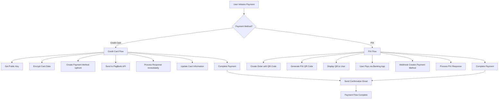
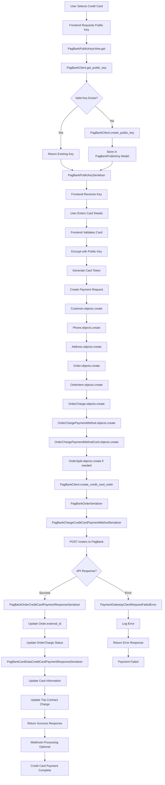
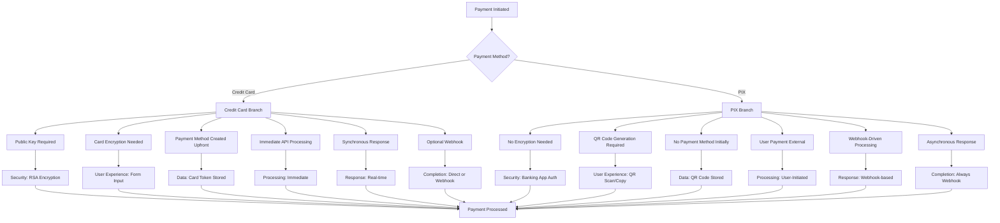
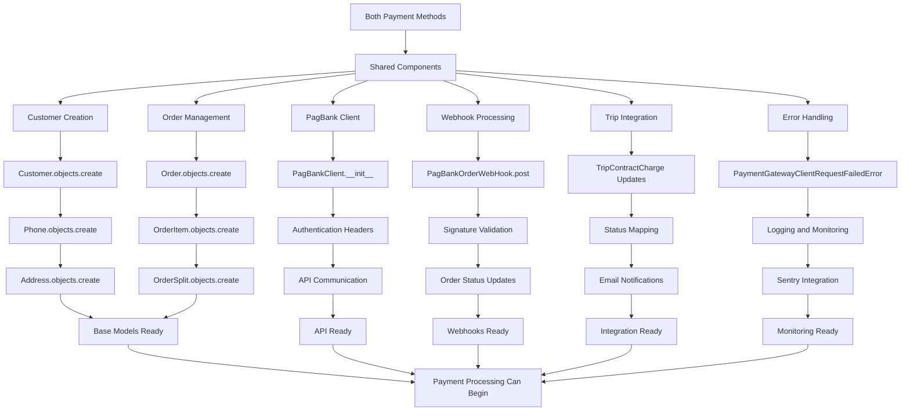
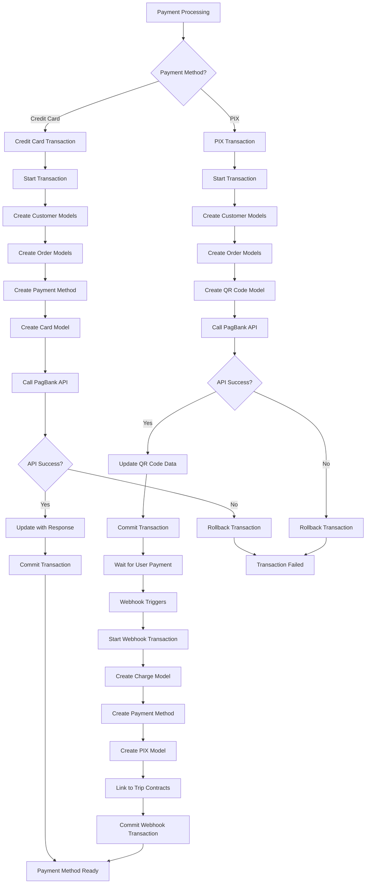
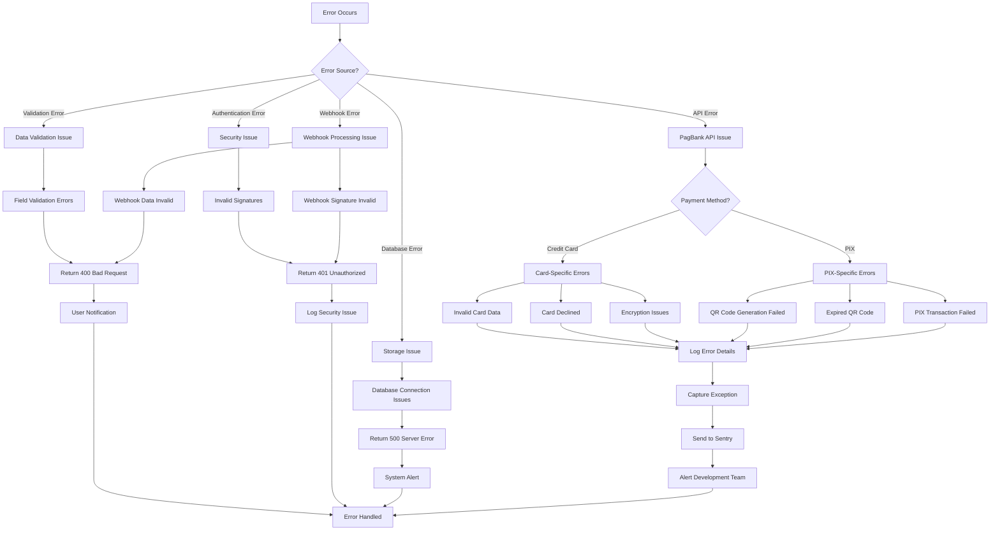
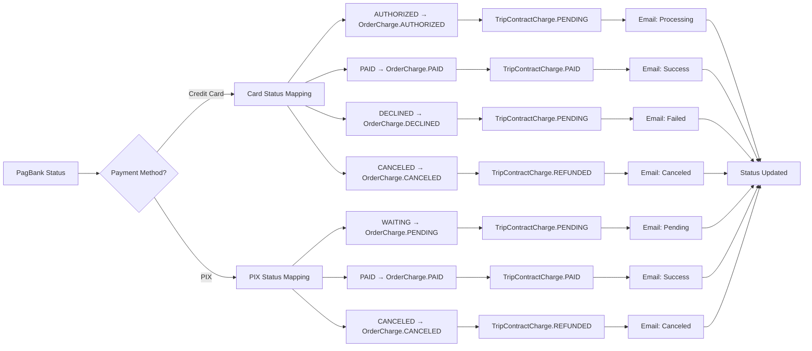

# PagBank Complete Payment Flows Documentation

## Overview

This document provides comprehensive flowcharts for both PIX and Credit Card payment processing in the PagBank integration, showing the complete journey from payment initiation to completion for both payment methods, including all classes, functions, views, and serializers involved.

## Unified Payment Flow Overview



## Complete Credit Card Payment Flow



## Complete PIX Payment Flow

```mermaid
flowchart TD
    A[User Selects PIX Payment] --> B[Create Payment Request]
    B --> C[Customer.objects.create]
    C --> D[Phone.objects.create]
    D --> E[Address.objects.create]
    E --> F[Order.objects.create]
    F --> G[OrderItem.objects.create]
    
    G --> H[OrderQRCode.objects.create]
    H --> I[Set amount and expiration]
    I --> J[OrderSplit.objects.create if needed]
    
    J --> K[PagBankClient.create_pix_order]
    K --> L[PagBankPixOrderSerializer]
    L --> M[PagBankQRCodeSerializer]
    M --> N[get_notification_urls method]
    N --> O[Include Webhook URLs]
    
    O --> P[POST /orders to PagBank]
    P --> Q{API Response?}
    
    Q -->|Success| R[PagBankPixOrderResponseSerializer]
    Q -->|Error| S[PaymentGatewayClientRequestFailedError]
    
    R --> T[Extract QR Code Data]
    T --> U[Update OrderQRCode Model]
    U --> V[qr_code.external_id]
    V --> W[qr_code.text PIX Code]
    W --> X[qr_code.png_link]
    X --> Y[qr_code.base64_link]
    
    Y --> Z[Return QR Code to Frontend]
    Z --> AA[Display QR Code to User]
    AA --> BB[User Scans QR or Copies Code]
    BB --> CC[User Opens Banking App]
    CC --> DD[User Confirms Payment]
    DD --> EE[PIX System Processes Payment]
    
    EE --> FF[PagBank Receives Confirmation]
    FF --> GG[PagBank Triggers Webhook]
    GG --> HH[POST /webhooks/orders/]
    HH --> II[PagBankOrderWebHook.post]
    
    II --> JJ{Production Environment?}
    JJ -->|Yes| KK[PagBankTokenAuthentication]
    JJ -->|No| LL[Skip Authentication]
    
    KK --> MM{Signature Valid?}
    MM -->|No| NN[Return 401 Unauthorized]
    MM -->|Yes| OO[Process Webhook]
    LL --> OO
    
    OO --> PP[PagBankOrderWebhookSerializer]
    PP --> QQ[PagBankChargeWebhookSerializer]
    QQ --> RR[Create OrderCharge from Webhook]
    RR --> SS[PagBankPaymentMethodSerializer]
    SS --> TT[Create OrderChargePaymentMethod]
    TT --> UU[Set type = 'PIX']
    UU --> VV[PagBankPixSerializer]
    VV --> WW[Create OrderChargePaymentMethodPIX]
    WW --> XX[Set PIX holder information]
    
    XX --> YY[Link to Trip Contract Charge]
    YY --> ZZ[Update Trip Status]
    ZZ --> AAA[Send Email Notification]
    AAA --> BBB[Return 204 No Content]
    
    S --> CCC[Log Error]
    CCC --> DDD[Return Error Response]
    NN --> EEE[Log Auth Failure]
    
    BBB --> FFF[PIX Payment Complete]
    DDD --> GGG[Payment Failed]
    EEE --> GGG
```



## Payment Method Comparison Flow



## Shared Components Flow



## Serializer Comparison Flow

```mermaid
flowchart TD
    A[Serializer Usage] --> B{Payment Method?}
    
    B -->|Credit Card| C[Credit Card Serializers]
    B -->|PIX| D[PIX Serializers]
    B -->|Both| E[Shared Serializers]
    
    C --> F[PagBankChargeCreditCardPaymentMethodSerializer]
    F --> G[Encrypts card data]
    F --> H[Sets type = 'CREDIT_CARD']
    F --> I[Handles installments]
    
    C --> J[PagBankOrderCreditCardPaymentResponseSerializer]
    J --> K[Processes API response]
    J --> L[Updates order and charge]
    
    C --> M[PagBankCardDataCreditCardPaymentResponseSerializer]
    M --> N[Updates card information]
    M --> O[Handles holder data]
    
    D --> P[PagBankQRCodeSerializer]
    P --> Q[Serializes QR code data]
    P --> R[Includes revenue splits]
    
    D --> S[PagBankPixOrderSerializer]
    S --> T[Includes notification URLs]
    S --> U[Handles QR codes array]
    
    D --> V[PagBankPixOrderResponseSerializer]
    V --> W[Processes QR response]
    V --> X[Updates QR code model]
    
    D --> Y[PagBankPixSerializer]
    Y --> Z[Handles PIX holder data]
    Y --> AA[Processes webhook PIX info]
    
    E --> BB[PagBankOrderSerializer]
    BB --> CC[Customer serialization]
    BB --> DD[Items serialization]
    
    E --> EE[PagBankOrderCustomerSerializer]
    EE --> FF[Customer data formatting]
    
    E --> GG[PagBankOrderWebhookSerializer]
    GG --> HH[Webhook data validation]
    GG --> II[Charge processing]
    
    E --> JJ[PagBankSplitReceiverSerializer]
    JJ --> KK[Revenue split handling]
    
    G --> LL[Card-Specific Processing]
    Q --> MM[PIX-Specific Processing]
    CC --> NN[Shared Processing]
    
    LL --> OO[Payment Method Created]
    MM --> OO
    NN --> OO
```



## Database Transaction Comparison



## Error Handling Unified Flow



## Status Mapping Unified Flow



## Key Differences Summary

### Credit Card vs PIX Payment Flow Differences

| Aspect | Credit Card | PIX |
|--------|-------------|-----|
| **Public Key** | Required for encryption | Not needed |
| **User Input** | Card details form | QR scan or copy-paste |
| **Payment Method Creation** | Before API call | After webhook |
| **API Response** | Immediate processing | QR code generation |
| **User Action** | Submit form | External banking app |
| **Real-time Processing** | Synchronous | Asynchronous |
| **Webhook Dependency** | Optional enhancement | Essential for completion |
| **Expiration** | None | QR code expires (1 hour) |
| **Security** | RSA encryption | Banking authentication |
| **Error Handling** | Immediate feedback | Delayed feedback |

### Shared Components

Both payment methods share:
- **Customer/Order Creation**: Same models and process
- **PagBank Client**: Same authentication and base methods
- **Webhook Infrastructure**: Same signature validation
- **Trip Integration**: Same status mapping and updates
- **Email Notifications**: Same notification system
- **Error Logging**: Same monitoring and alerting

### Models Usage

```python
# Shared Models (Both Methods)
Customer, Phone, Address, Order, OrderItem, OrderCharge, OrderSplit

# Credit Card Specific
OrderChargePaymentMethodCard
PagBankPublicKey

# PIX Specific  
OrderQRCode
OrderChargePaymentMethodPIX

# Conditional (Created by webhook for PIX, upfront for Card)
OrderChargePaymentMethod
```

### Serializers Usage

```python
# Shared Serializers
PagBankOrderSerializer
PagBankOrderCustomerSerializer
PagBankOrderItemSerializer
PagBankSplitReceiverSerializer
PagBankOrderWebhookSerializer

# Credit Card Specific
PagBankChargeCreditCardPaymentMethodSerializer
PagBankOrderCreditCardPaymentResponseSerializer
PagBankCardDataCreditCardPaymentResponseSerializer
PagBankPublicKeySerializer

# PIX Specific
PagBankQRCodeSerializer
PagBankPixOrderSerializer
PagBankPixOrderResponseSerializer
PagBankPixSerializer
```

This comprehensive documentation provides a complete understanding of both payment flows, their similarities, differences, and how they integrate into your overall payment processing system. The unified approach helps developers understand when to use shared components and when payment-method-specific logic is required.