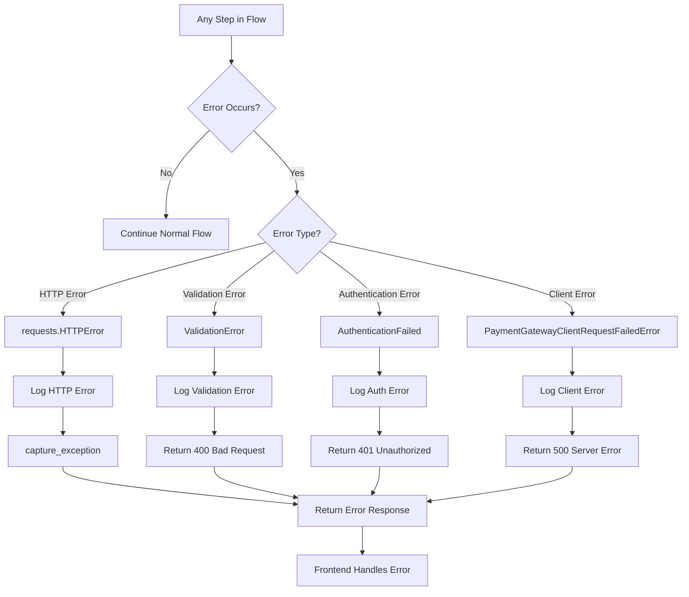
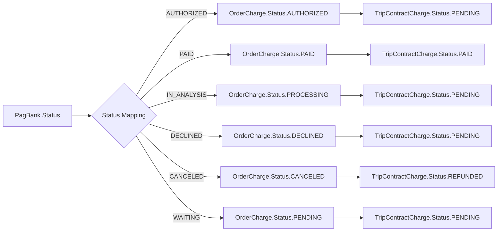
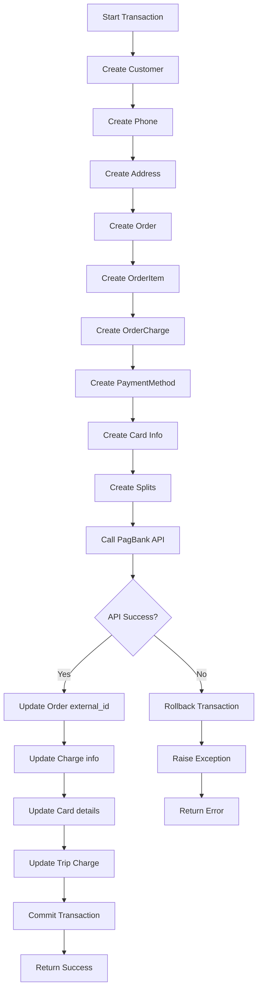

# PagBank Credit Card Payment Flow

## Overview

This document provides a detailed flowchart of the credit card payment process in the PagBank integration, showing the complete journey from payment initiation to completion, including all classes, functions, views, and serializers involved.

## Complete Credit Card Payment Flow

```mermaid
flowchart TD
    A[Frontend Application] --> B[Get Public Key]
    B --> C[PagBankPublicKeysView.get]
    C --> D[PagBankClient.__init__]
    D --> E[PagBankClient.get_public_key]
    E --> F{Public Key Exists?}
    
    F -->|No| G[PagBankClient.create_public_key]
    F -->|Yes| H[PagBankPublicKey.valid_objects]
    
    G --> I[POST /public-keys]
    I --> J[PagBankPublicKeyManager.create_from_api_response_data]
    J --> K[Return Public Key]
    H --> K
    
    K --> L[PagBankPublicKeySerializer]
    L --> M[Frontend Receives Key]
    
    M --> N[User Enters Card Data]
    N --> O[Frontend Encrypts Card]
    O --> P[Create Payment Request]
    
    P --> Q[Payment Processing View/API]
    Q --> R[Create Customer Model]
    R --> S[Customer.objects.create]
    
    S --> T[Create Phone Model]
    T --> U[Phone.objects.create]
    
    U --> V[Create Address Model]
    V --> W[Address.objects.create]
    
    W --> X[Create Order Model]
    X --> Y[Order.objects.create]
    
    Y --> Z[Create OrderItem Model]
    Z --> AA[OrderItem.objects.create]
    
    AA --> BB[Create OrderCharge Model]
    BB --> CC[OrderCharge.objects.create]
    
    CC --> DD[Create OrderChargePaymentMethod]
    DD --> EE[OrderChargePaymentMethod.objects.create]
    
    EE --> FF[Create OrderChargePaymentMethodCard]
    FF --> GG[OrderChargePaymentMethodCard.objects.create]
    
    GG --> HH[Create OrderSplit if needed]
    HH --> II[OrderSplit.objects.create]
    
    II --> JJ[PagBankClient.create_credit_card_order]
    JJ --> KK[PagBankOrderSerializer.__init__]
    KK --> LL[PagBankOrderCustomerSerializer]
    LL --> MM[PagBankOrderCustomerPhoneSerializer]
    MM --> NN[PagBankOrderItemSerializer]
    NN --> OO[PagBankChargeSerializer]
    OO --> PP[PagBankChargeCreditCardPaymentMethodSerializer]
    PP --> QQ[PagBankSplitReceiverSerializer]
    
    QQ --> RR[Serialize Order Data]
    RR --> SS[POST /orders to PagBank API]
    SS --> TT{API Response OK?}
    
    TT -->|No| UU[Handle API Error]
    UU --> VV[PaymentGatewayClientRequestFailedError]
    VV --> WW[Log Error]
    WW --> XX[Return Error Response]
    
    TT -->|Yes| YY[PagBankOrderCreditCardPaymentResponseSerializer]
    YY --> ZZ[Validate Response Data]
    ZZ --> AAA[Update Order.external_id]
    AAA --> BBB[Update OrderCharge.external_id]
    BBB --> CCC[Update OrderCharge.status]
    CCC --> DDD[PagBankCardDataCreditCardPaymentResponseSerializer]
    DDD --> EEE[Update Card Information]
    EEE --> FFF[Update Trip Contract Charge]
    FFF --> GGG[Set TripContractCharge.status = PAID]
    
    GGG --> HHH[Return Success Response]
    HHH --> III[Frontend Shows Success]
    
    III --> JJJ[PagBank Webhook Trigger]
    JJJ --> KKK[POST /webhooks/orders/]
    KKK --> LLL[PagBankOrderWebHook.post]
    
    LLL --> MMM{Environment = Production?}
    MMM -->|Yes| NNN[PagBankTokenAuthentication.authenticate]
    MMM -->|No| OOO[Skip Authentication]
    
    NNN --> PPP[Extract X-Authenticity-Token]
    PPP --> QQQ[generate_signature]
    QQQ --> RRR{Signature Valid?}
    
    RRR -->|No| SSS[AuthenticationFailed]
    SSS --> TTT[Return 401 Unauthorized]
    
    RRR -->|Yes| UUU[Get Order by external_id]
    OOO --> UUU
    
    UUU --> VVV[PagBankClient.update_pix_order]
    VVV --> WWW[PagBankOrderWebhookSerializer]
    WWW --> XXX[PagBankChargeWebhookSerializer]
    XXX --> YYY[PagBankPaymentMethodSerializer]
    YYY --> ZZZ[Validate Webhook Data]
    
    ZZZ --> AAAA{Validation OK?}
    AAAA -->|No| BBBB[ValidationError]
    BBBB --> CCCC[Return 400 Bad Request]
    
    AAAA -->|Yes| DDDD[Update OrderCharge Status]
    DDDD --> EEEE[Create/Update Payment Method]
    EEEE --> FFFF[Link to Trip Contract Charge]
    FFFF --> GGGG[Update Trip Status]
    GGGG --> HHHH[Send Email Notification]
    HHHH --> IIII[send_email_with_payment_status_update.delay]
    IIII --> JJJJ[Return 204 No Content]
    
    JJJJ --> KKKK[Payment Flow Complete]
```



## Detailed Component Breakdown

### 1. Public Key Retrieval Phase

#### Components Involved:
- **View**: `PagBankPublicKeysView`
- **Client**: `PagBankClient`
- **Model**: `PagBankPublicKey`
- **Manager**: `PagBankPublicKeyManager`
- **Serializer**: `PagBankPublicKeySerializer`

```python
# Flow sequence:
1. PagBankPublicKeysView.get()
2. PagBankClient.__init__()
3. PagBankClient.get_public_key()
4. PagBankPublicKey.valid_objects.order_by("-created_at").first()
5. If no key: PagBankClient.create_public_key()
6. PagBankPublicKeyManager.create_from_api_response_data()
7. PagBankPublicKeySerializer({"key": public_key})
```

### 2. Order Creation Phase

#### Models Created in Sequence:
```python
# 1. Customer Information
Customer.objects.create(
    name="João Silva",
    email="joao@example.com", 
    document="12345678901"
)

# 2. Phone Information
Phone.objects.create(
    customer=customer,
    country_code="55",
    area_code="11",
    number="999999999"
)

# 3. Address Information (if provided)
Address.objects.create(
    state="SP",
    city="São Paulo",
    district="Centro",
    street="Rua das Flores",
    number="123",
    zip_code="01234567"
)

# 4. Main Order
Order.objects.create(
    customer=customer,
    payment_gateway="PAGBANK"
)

# 5. Order Items
OrderItem.objects.create(
    order=order,
    reference_id="item_123",
    name="Product Name",
    quantity=1,
    unit_amount=10000
)

# 6. Payment Charge
OrderCharge.objects.create(
    order=order,
    reference_id="charge_123",
    description="Payment description",
    value=10000,
    currency="BRL"
)

# 7. Payment Method
OrderChargePaymentMethod.objects.create(
    charge=charge,
    type="CREDIT_CARD",
    installments=1
)

# 8. Card Information
OrderChargePaymentMethodCard.objects.create(
    payment_method=payment_method,
    card_token="encrypted_token_from_frontend"
)

# 9. Revenue Splits (if marketplace)
OrderSplit.objects.create(
    order=order,
    account_external_id="ACCO_PLATFORM",
    percentage=5.00,
    is_platform=True
)
```

### 3. Payment Processing Phase

#### Serialization Chain:
```python
# Main serializer
PagBankOrderSerializer(order) -> {
    # Customer data
    "customer": PagBankOrderCustomerSerializer(customer) -> {
        "name": "João Silva",
        "email": "joao@example.com",
        "tax_id": "12345678901",
        "phones": [
            PagBankOrderCustomerPhoneSerializer(phone) -> {
                "country": "55",
                "area": "11", 
                "number": "999999999",
                "type": "MOBILE"
            }
        ]
    },
    
    # Order items
    "items": [
        PagBankOrderItemSerializer(item) -> {
            "reference_id": "item_123",
            "name": "Product Name",
            "quantity": 1,
            "unit_amount": 10000
        }
    ],
    
    # Payment charges
    "charges": [
        PagBankChargeSerializer(charge) -> {
            "reference_id": "charge_123",
            "description": "Payment description",
            "amount": {"value": 10000, "currency": "BRL"},
            "payment_method": PagBankChargeCreditCardPaymentMethodSerializer() -> {
                "type": "CREDIT_CARD",
                "installments": 1,
                "capture": True,
                "card": {"encrypted": "token_here"}
            },
            "splits": {
                "method": "PERCENTAGE",
                "receivers": [
                    PagBankSplitReceiverSerializer(split) -> {
                        "account": {"id": "ACCO_PLATFORM"},
                        "amount": {"value": 5.00}
                    }
                ]
            }
        }
    ]
}
```

#### API Communication:
```python
# PagBankClient.create_credit_card_order()
1. url = f"{self.api_url}/orders"
2. headers = self._get_headers()  # Authorization + Content-Type
3. data = PagBankOrderSerializer(order).data
4. response = requests.post(url, headers=headers, json=data, timeout=30)
5. log_from_requests_response(response)  # Log with redacted auth
6. response.raise_for_status()  # Handle HTTP errors
```

### 4. Response Processing Phase

#### Response Deserialization:
```python
# PagBankOrderCreditCardPaymentResponseSerializer
response_data = {
    "id": "ORDER_123456789",
    "reference_id": "order_ref_123",
    "charges": [{
        "id": "CHAR_123456789", 
        "reference_id": "charge_123",
        "status": "PAID",
        "paid_at": "2024-01-15T10:30:00Z",
        "payment_method": {
            "card": {
                "brand": "visa",
                "first_digits": "411111",
                "last_digits": "1111",
                "exp_month": "12",
                "exp_year": "2025",
                "holder": {
                    "name": "JOAO SILVA",
                    "document": "12345678901"
                }
            }
        }
    }]
}

# Processing sequence:
1. PagBankOrderCreditCardPaymentResponseSerializer(order, data=response_data)
2. serializer.is_valid(raise_exception=True)
3. serializer.save() -> Updates:
   - order.external_id = "ORDER_123456789"
   - charge.external_id = "CHAR_123456789" 
   - charge.status = "PAID"
   - charge.paid_at = parsed_datetime
4. PagBankCardDataCreditCardPaymentResponseSerializer() -> Updates card info
5. trip_contract_charge.status = TripContractCharge.Status.PAID
```

### 5. Webhook Processing Phase

#### Webhook Authentication:
```python
# PagBankTokenAuthentication.authenticate()
1. token = request.headers.get("X-Authenticity-Token")
2. api_token = PagBankClient().get_api_token()
3. payload = json.dumps(request.data, separators=(",", ":"))
4. expected_token = generate_signature(api_token, payload)
5. if token != expected_token: raise AuthenticationFailed
6. return (AnonymousUser, None)
```

#### Webhook Data Processing:
```python
# PagBankOrderWebHook.post()
1. order_id = request.headers.get("x-product-id")
2. order = get_object_or_404(Order, external_id=order_id)
3. return PagBankClient().update_pix_order(request, order, request.data)

# PagBankClient.update_pix_order()
1. PagBankOrderWebhookSerializer(order, data=webhook_data)
2. serializer.is_valid(raise_exception=True)
3. serializer.save() -> Calls PagBankChargeWebhookSerializer
4. Link payment to trip contract charges
5. send_email_with_payment_status_update.delay()
6. return DRFResponse(status=204)
```

## Error Handling Flow



## Status Mapping Flow



## Database Transaction Flow



## Key Classes and Their Responsibilities

### Models
- **`Customer`**: Store customer information
- **`Phone`**: Customer phone number
- **`Address`**: Customer address
- **`Order`**: Main order container
- **`OrderItem`**: Individual order items
- **`OrderCharge`**: Payment charge information
- **`OrderChargePaymentMethod`**: Payment method details
- **`OrderChargePaymentMethodCard`**: Credit card specifics
- **`OrderSplit`**: Revenue splitting configuration
- **`PagBankPublicKey`**: Encryption key management

### Serializers
- **`PagBankOrderSerializer`**: Main order serialization
- **`PagBankOrderCustomerSerializer`**: Customer data serialization
- **`PagBankChargeSerializer`**: Charge data serialization
- **`PagBankOrderCreditCardPaymentResponseSerializer`**: Response processing
- **`PagBankPublicKeySerializer`**: Public key data

### Views
- **`PagBankPublicKeysView`**: Public key endpoint
- **`PagBankOrderWebHook`**: Webhook processing

### Client
- **`PagBankClient`**: Main API communication class

### Managers
- **`PagBankPublicKeyManager`**: Public key database operations

This comprehensive flow shows every component involved in processing a credit card payment through the PagBank integration, from initial public key retrieval to final webhook processing and notification.