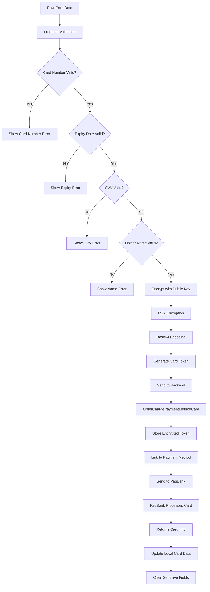
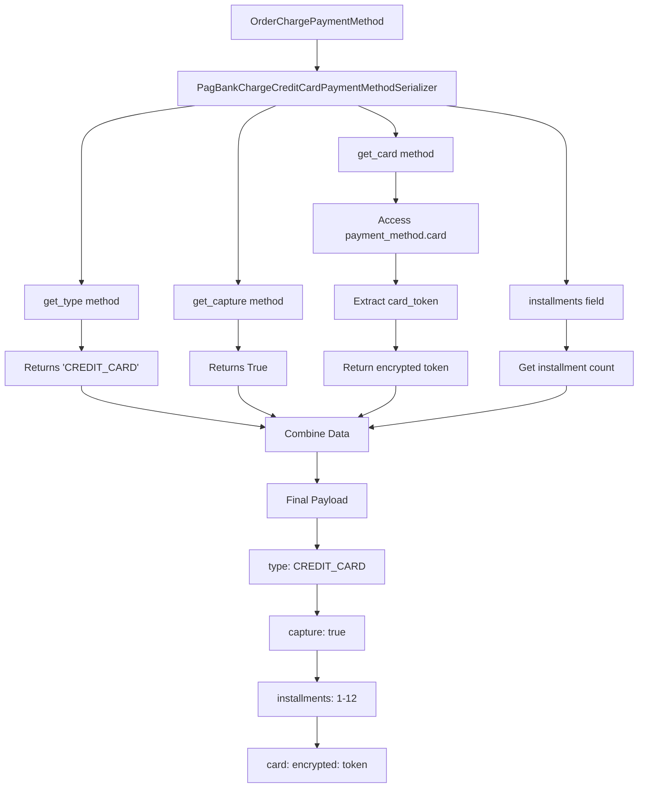
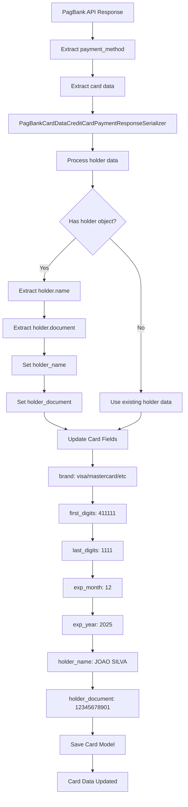
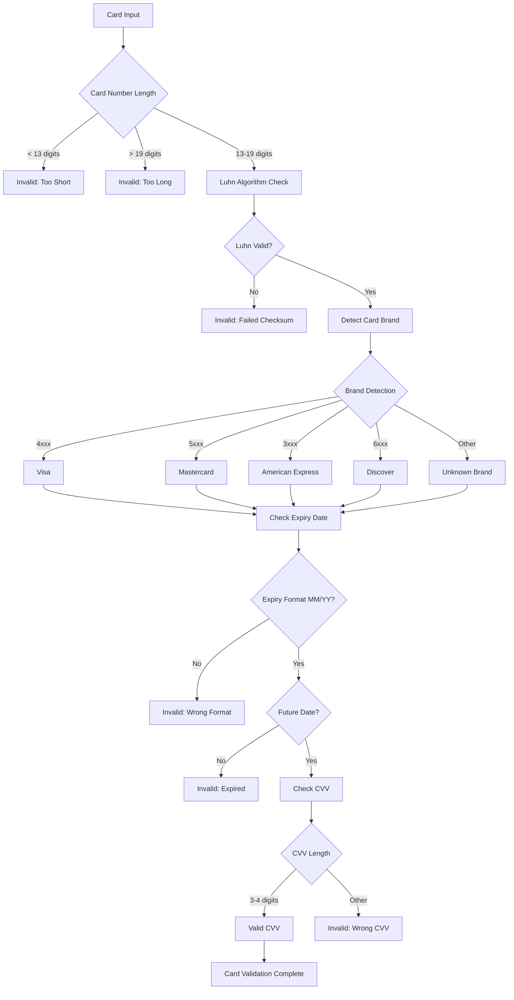
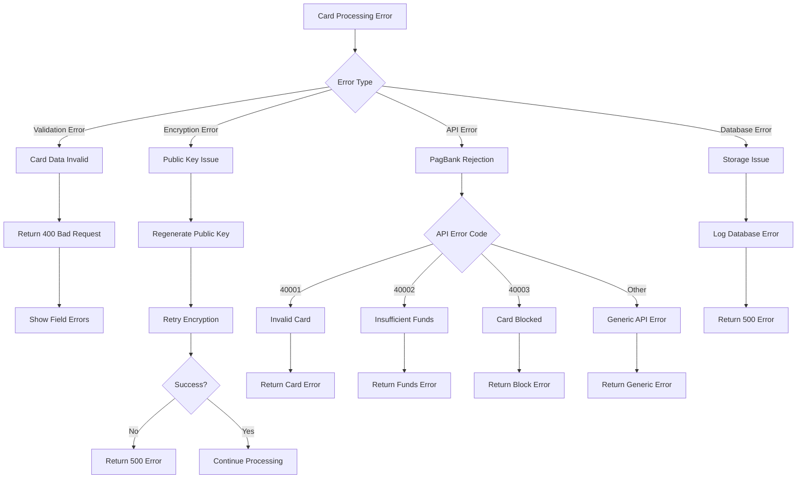
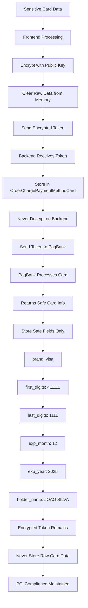

# PagBank Credit Card Payment Method Flow

## Overview

This document provides a detailed flowchart specifically for the credit card payment method processing in the PagBank integration, focusing on card encryption, tokenization, validation, and payment method handling.

## Credit Card Payment Method Flow

```mermaid
flowchart TD
    A[User Opens Payment Form] --> B[Frontend Requests Public Key]
    B --> C[GET /api/payments/integrations/pagbank/public-keys/]
    C --> D[PagBankPublicKeysView.get]
    
    D --> E[PagBankClient.get_public_key]
    E --> F{Valid Key in DB?}
    
    F -->|No| G[PagBankClient.create_public_key]
    F -->|Yes| H[Return Existing Key]
    
    G --> I[POST /public-keys to PagBank]
    I --> J[PagBankPublicKeyManager.create_from_api_response_data]
    J --> K[Store Key in Database]
    K --> L[Return Public Key]
    H --> L
    
    L --> M[PagBankPublicKeySerializer]
    M --> N[Frontend Receives Public Key]
    
    N --> O[User Enters Card Details]
    O --> P[Card Number: 4111111111111111]
    P --> Q[Expiry Date: 12/25]
    Q --> R[CVV: 123]
    R --> S[Holder Name: JOAO SILVA]
    S --> T[Holder Document: 12345678901]
    
    T --> U[Frontend Validates Card Format]
    U --> V{Card Valid?}
    
    V -->|No| W[Show Validation Error]
    W --> O
    
    V -->|Yes| X[Encrypt Card Data with Public Key]
    X --> Y[Generate Encrypted Token]
    Y --> Z[Create Payment Request]
    
    Z --> AA[POST Payment Request to Backend]
    AA --> BB[Backend Payment View/API]
    BB --> CC[Create OrderChargePaymentMethod]
    
    CC --> DD[OrderChargePaymentMethod.objects.create]
    DD --> EE[Set type = 'CREDIT_CARD']
    EE --> FF[Set installments count]
    FF --> GG[Link to OrderCharge]
    
    GG --> HH[Create OrderChargePaymentMethodCard]
    HH --> II[OrderChargePaymentMethodCard.objects.create]
    II --> JJ[Store card_token from frontend]
    JJ --> KK[Set payment_method relationship]
    
    KK --> LL[PagBankClient.create_credit_card_order]
    LL --> MM[PagBankOrderSerializer initialization]
    MM --> NN[PagBankChargeSerializer]
    NN --> OO[PagBankChargeCreditCardPaymentMethodSerializer]
    
    OO --> PP[Serialize Payment Method Data]
    PP --> QQ{Has Card Token?}
    
    QQ -->|No| RR[Validation Error]
    RR --> SS[Return 400 Bad Request]
    
    QQ -->|Yes| TT[Build Card Object]
    TT --> UU[card: encrypted: card_token]
    UU --> VV[type: CREDIT_CARD]
    VV --> WW[installments: count]
    WW --> XX[capture: true]
    
    XX --> YY[Send to PagBank API]
    YY --> ZZ[POST /orders with card data]
    ZZ --> AAA{PagBank Response?}
    
    AAA -->|Error| BBB[Handle API Error]
    BBB --> CCC[PaymentGatewayClientRequestFailedError]
    CCC --> DDD[Log Error Details]
    DDD --> EEE[Return Error to Frontend]
    
    AAA -->|Success| FFF[PagBankOrderCreditCardPaymentResponseSerializer]
    FFF --> GGG[Extract Response Data]
    GGG --> HHH[Update Order.external_id]
    HHH --> III[Update OrderCharge.external_id]
    III --> JJJ[Update OrderCharge.status]
    JJJ --> KKK[Update OrderCharge.paid_at]
    
    KKK --> LLL[PagBankCardDataCreditCardPaymentResponseSerializer]
    LLL --> MMM[Process Card Response Data]
    MMM --> NNN[Extract Card Information]
    
    NNN --> OOO[Update Card.brand]
    OOO --> PPP[Update Card.first_digits]
    PPP --> QQQ[Update Card.last_digits]
    QQQ --> RRR[Update Card.exp_month]
    RRR --> SSS[Update Card.exp_year]
    SSS --> TTT[Update Card.holder_name]
    TTT --> UUU[Update Card.holder_document]
    
    UUU --> VVV[Clear Sensitive Data]
    VVV --> WWW[card_token remains encrypted]
    WWW --> XXX[Save Card Model]
    
    XXX --> YYY[Update Trip Contract Charge]
    YYY --> ZZZ[Set status = PAID]
    ZZZ --> AAAA[Set paid_at timestamp]
    
    AAAA --> BBBB[Return Success Response]
    BBBB --> CCCC[Frontend Shows Success]
    
    CCCC --> DDDD[PagBank Webhook Triggered]
    DDDD --> EEEE[Webhook Updates Card Status]
    EEEE --> FFFF[Payment Method Complete]
```



## Card Data Processing Flow



## Payment Method Serialization Flow



## Card Response Processing Flow



## Card Validation Flow



## Error Handling for Card Processing



## Card Security Flow



## Key Components for Card Processing

### Models
```python
# OrderChargePaymentMethod
class OrderChargePaymentMethod(models.Model):
    charge = models.OneToOneField(OrderCharge)
    type = models.CharField(choices=Types.choices)  # "CREDIT_CARD"
    installments = models.IntegerField(default=1)

# OrderChargePaymentMethodCard  
class OrderChargePaymentMethodCard(models.Model):
    payment_method = models.OneToOneField(OrderChargePaymentMethod)
    card_token = models.CharField(max_length=1024)  # Encrypted
    brand = models.CharField(max_length=50)         # "visa"
    first_digits = models.CharField(max_length=6)   # "411111"
    last_digits = models.CharField(max_length=4)    # "1111"
    exp_month = models.CharField(max_length=2)      # "12"
    exp_year = models.CharField(max_length=4)       # "2025"
    holder_name = models.CharField(max_length=100)  # "JOAO SILVA"
    holder_document = models.CharField(max_length=14) # "12345678901"
```

### Serializers
```python
# Request Serialization
class PagBankChargeCreditCardPaymentMethodSerializer(serializers.ModelSerializer):
    def get_type(self, _) -> str:
        return "CREDIT_CARD"
    
    def get_capture(self, _) -> bool:
        return True
    
    def get_card(self, obj: OrderChargePaymentMethod) -> dict:
        return {"encrypted": obj.card.card_token}

# Response Deserialization
class PagBankCardDataCreditCardPaymentResponseSerializer(serializers.ModelSerializer):
    def save(self, **kwargs):
        # Extract holder data from response
        holder_data = self.initial_data.pop("holder", None)
        if holder_data:
            self.instance.holder_name = holder_data.get("name")
            self.instance.holder_document = holder_data.get("document")
        
        # Update other card fields
        for attr, value in self.validated_data.items():
            setattr(self.instance, attr, value)
        
        self.instance.save()
```

### Client Methods
```python
class PagBankClient:
    def create_credit_card_order(self, order: Order) -> requests.Response:
        # Serialize order with card data
        serializer = PagBankOrderSerializer(order)
        data = serializer.data
        
        # Send to PagBank API
        response = requests.post(url, headers=headers, json=data)
        
        # Process response and update card info
        response_serializer = PagBankOrderCreditCardPaymentResponseSerializer(
            order, data=response.json()
        )
        response_serializer.is_valid(raise_exception=True)
        response_serializer.save()
        
        return response
```

## Card Data Flow Summary

1. **Frontend**: User enters card details → Validates format → Encrypts with public key → Sends token
2. **Backend**: Creates payment method models → Stores encrypted token → Serializes for API
3. **PagBank**: Processes encrypted card → Returns safe card information
4. **Storage**: Updates card model with safe fields → Keeps token encrypted → Never stores raw data
5. **Webhooks**: Receives status updates → Updates payment status → Maintains security

This flow ensures PCI compliance by never storing raw card data while providing complete payment processing functionality through the PagBank integration.