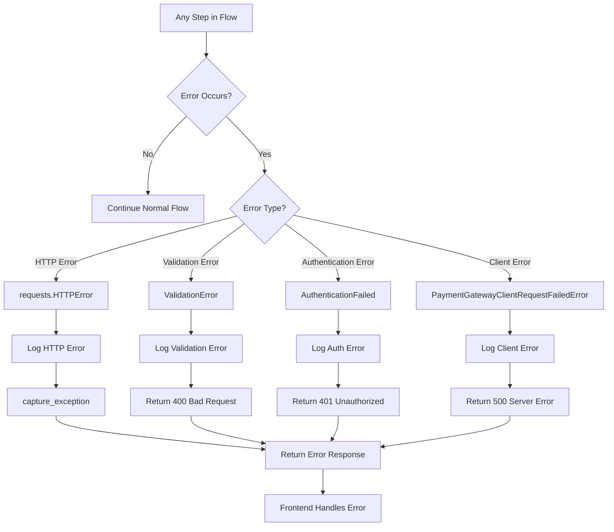
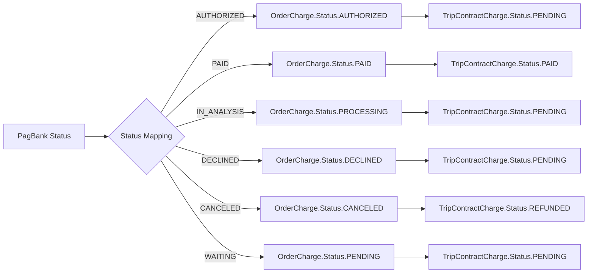
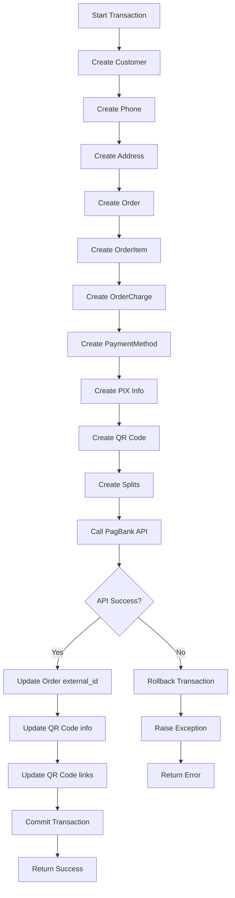
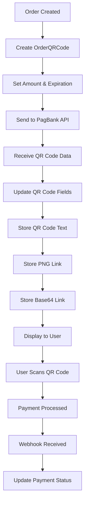

# PagBank PIX Payment Flow

## Overview

This document provides a detailed flowchart of the PIX payment process in the PagBank integration, showing the complete journey from payment initiation to completion, including all classes, functions, views, and serializers involved.

## Complete PIX Payment Flow

```mermaid
flowchart TD
    A[Frontend Application] --> B[User Selects PIX Payment]
    B --> C[Create Payment Request]
    
    C --> D[Payment Processing View/API]
    D --> E[Create Customer Model]
    E --> F[Customer.objects.create]
    
    F --> G[Create Phone Model]
    G --> H[Phone.objects.create]
    
    H --> I[Create Address Model]
    I --> J[Address.objects.create]
    
    J --> K[Create Order Model]
    K --> L[Order.objects.create]
    
    L --> M[Create OrderItem Model]
    M --> N[OrderItem.objects.create]
    
    N --> O[Create OrderCharge Model]
    O --> P[OrderCharge.objects.create]
    
    P --> Q[Create OrderChargePaymentMethod]
    Q --> R[OrderChargePaymentMethod.objects.create]
    
    R --> S[Create OrderChargePaymentMethodPIX]
    S --> T[OrderChargePaymentMethodPIX.objects.create]
    
    T --> U[Create OrderQRCode Model]
    U --> V[OrderQRCode.objects.create]
    
    V --> W[Create OrderSplit if needed]
    W --> X[OrderSplit.objects.create]
    
    X --> Y[PagBankClient.create_pix_order]
    Y --> Z[PagBankPixOrderSerializer.__init__]
    Z --> AA[PagBankOrderCustomerSerializer]
    AA --> BB[PagBankOrderCustomerPhoneSerializer]
    BB --> CC[PagBankOrderItemSerializer]
    CC --> DD[PagBankQRCodeSerializer]
    DD --> EE[PagBankSplitReceiverSerializer]
    
    EE --> FF[Serialize Order Data]
    FF --> GG[POST /orders to PagBank API]
    GG --> HH{API Response OK?}
    
    HH -->|No| II[Handle API Error]
    II --> JJ[PaymentGatewayClientRequestFailedError]
    JJ --> KK[Log Error]
    KK --> LL[Return Error Response]
    
    HH -->|Yes| MM[PagBankPixOrderResponseSerializer]
    MM --> NN[Validate Response Data]
    NN --> OO[Update Order.external_id]
    OO --> PP[Update OrderQRCode.external_id]
    PP --> QQ[Update OrderQRCode.text]
    QQ --> RR[Update OrderQRCode.png_link]
    RR --> SS[Update OrderQRCode.base64_link]
    
    SS --> TT[Return Success Response]
    TT --> UU[Frontend Shows QR Code]
    
    UU --> VV[User Scans QR Code]
    VV --> WW[User Pays via PIX App]
    WW --> XX[PagBank Webhook Trigger]
    XX --> YY[POST /webhooks/orders/]
    YY --> ZZ[PagBankOrderWebHook.post]
    
    ZZ --> AAA{Environment = Production?}
    AAA -->|Yes| BBB[PagBankTokenAuthentication.authenticate]
    AAA -->|No| CCC[Skip Authentication]
    
    BBB --> DDD[Extract X-Authenticity-Token]
    DDD --> EEE[generate_signature]
    EEE --> FFF{Signature Valid?}
    
    FFF -->|No| GGG[AuthenticationFailed]
    GGG --> HHH[Return 401 Unauthorized]
    
    FFF -->|Yes| III[Get Order by external_id]
    CCC --> III
    
    III --> JJJ[PagBankClient.update_pix_order]
    JJJ --> KKK[PagBankOrderWebhookSerializer]
    KKK --> LLL[PagBankChargeWebhookSerializer]
    LLL --> MMM[PagBankPaymentMethodSerializer]
    MMM --> NNN[PagBankPixSerializer]
    NNN --> OOO[Validate Webhook Data]
    
    OOO --> PPP{Validation OK?}
    PPP -->|No| QQQ[ValidationError]
    QQQ --> RRR[Return 400 Bad Request]
    
    PPP -->|Yes| SSS[Update OrderCharge Status]
    SSS --> TTT[Create/Update Payment Method]
    TTT --> UUU[Create/Update PIX Information]
    UUU --> VVV[Link to Trip Contract Charge]
    VVV --> WWW[Update Trip Status]
    WWW --> XXX[Send Email Notification]
    XXX --> YYY[send_email_with_payment_status_update.delay]
    YYY --> ZZZ[Return 204 No Content]
    
    ZZZ --> AAAA[Payment Flow Complete]
```



## Detailed Component Breakdown

### 1. Order Creation Phase

#### Models Created in Sequence:
```python
# 1. Customer Information
Customer.objects.create(
    name="João Silva",
    email="joao@example.com", 
    document="12345678901"
)

# 2. Phone Information
Phone.objects.create(
    customer=customer,
    country_code="55",
    area_code="11",
    number="999999999"
)

# 3. Address Information (if provided)
Address.objects.create(
    state="SP",
    city="São Paulo",
    district="Centro",
    street="Rua das Flores",
    number="123",
    zip_code="01234567"
)

# 4. Main Order
Order.objects.create(
    customer=customer,
    payment_gateway="PAGBANK"
)

# 5. Order Items
OrderItem.objects.create(
    order=order,
    reference_id="item_123",
    name="Product Name",
    quantity=1,
    unit_amount=10000
)

# 6. Payment Charge
OrderCharge.objects.create(
    order=order,
    reference_id="charge_123",
    description="Payment description",
    value=10000,
    currency="BRL"
)

# 7. Payment Method
OrderChargePaymentMethod.objects.create(
    charge=charge,
    type="PIX"
)

# 8. PIX Information
OrderChargePaymentMethodPIX.objects.create(
    payment_method=payment_method,
    holder_name="João Silva",
    holder_document="12345678901"
)

# 9. QR Code Information
OrderQRCode.objects.create(
    order=order,
    amount=10000,
    expiration=timezone.now() + timedelta(minutes=30)
)

# 10. Revenue Splits (if marketplace)
OrderSplit.objects.create(
    order=order,
    account_external_id="ACCO_PLATFORM",
    percentage=5.00,
    is_platform=True
)
```

### 2. Payment Processing Phase

#### Serialization Chain:
```python
# Main serializer
PagBankPixOrderSerializer(order) -> {
    # Customer data
    "customer": PagBankOrderCustomerSerializer(customer) -> {
        "name": "João Silva",
        "email": "joao@example.com",
        "tax_id": "12345678901",
        "phones": [
            PagBankOrderCustomerPhoneSerializer(phone) -> {
                "country": "55",
                "area": "11", 
                "number": "999999999",
                "type": "MOBILE"
            }
        ]
    },
    
    # Order items
    "items": [
        PagBankOrderItemSerializer(item) -> {
            "reference_id": "item_123",
            "name": "Product Name",
            "quantity": 1,
            "unit_amount": 10000
        }
    ],
    
    # QR Codes
    "qr_codes": [
        PagBankQRCodeSerializer(qr_code) -> {
            "amount": {"value": 10000, "currency": "BRL"},
            "expiration_date": "2024-01-15T11:00:00Z",
            "splits": {
                "method": "PERCENTAGE",
                "receivers": [
                    PagBankSplitReceiverSerializer(split) -> {
                        "account": {"id": "ACCO_PLATFORM"},
                        "amount": {"value": 5.00}
                    }
                ]
            }
        }
    ],
    
    # Notification URLs
    "notification_urls": ["https://api.example.com/webhooks/orders/"]
}
```

#### API Communication:
```python
# PagBankClient.create_pix_order()
1. url = f"{self.api_url}/orders"
2. headers = self._get_headers()  # Authorization + Content-Type
3. data = PagBankPixOrderSerializer(order).data
4. response = requests.post(url, headers=headers, json=data, timeout=30)
5. log_from_requests_response(response)  # Log with redacted auth
6. response.raise_for_status()  # Handle HTTP errors
```

### 3. Response Processing Phase

#### Response Deserialization:
```python
# PagBankPixOrderResponseSerializer
response_data = {
    "id": "ORDER_123456789",
    "reference_id": "order_ref_123",
    "qr_codes": [{
        "id": "QR_123456789",
        "expiration_date": "2024-01-15T11:00:00Z",
        "amount": {"value": 10000, "currency": "BRL"},
        "text": "00020126580014br.gov.bcb.pix...",
        "links": [
            {
                "rel": "PNG",
                "href": "https://api.pagbank.com.br/qr-codes/QR_123456789.png"
            },
            {
                "rel": "BASE64",
                "href": "https://api.pagbank.com.br/qr-codes/QR_123456789/base64"
            }
        ]
    }]
}

# Processing sequence:
1. PagBankPixOrderResponseSerializer(order, data=response_data)
2. serializer.is_valid(raise_exception=True)
3. serializer.save() -> Updates:
   - order.external_id = "ORDER_123456789"
   - qr_code.external_id = "QR_123456789"
   - qr_code.text = "00020126580014br.gov.bcb.pix..."
   - qr_code.png_link = "https://api.pagbank.com.br/qr-codes/QR_123456789.png"
   - qr_code.base64_link = "https://api.pagbank.com.br/qr-codes/QR_123456789/base64"
```

### 4. Webhook Processing Phase

#### Webhook Authentication:
```python
# PagBankTokenAuthentication.authenticate()
1. token = request.headers.get("X-Authenticity-Token")
2. api_token = PagBankClient().get_api_token()
3. payload = json.dumps(request.data, separators=(",", ":"))
4. expected_token = generate_signature(api_token, payload)
5. if token != expected_token: raise AuthenticationFailed
6. return (AnonymousUser, None)
```

#### Webhook Data Processing:
```python
# PagBankOrderWebHook.post()
1. order_id = request.headers.get("x-product-id")
2. order = get_object_or_404(Order, external_id=order_id)
3. return PagBankClient().update_pix_order(request, order, request.data)

# PagBankClient.update_pix_order()
1. PagBankOrderWebhookSerializer(order, data=webhook_data)
2. serializer.is_valid(raise_exception=True)
3. serializer.save() -> Calls PagBankChargeWebhookSerializer
4. Create/Update PIX payment method information
5. Link payment to trip contract charges
6. send_email_with_payment_status_update.delay()
7. return DRFResponse(status=204)
```

#### PIX Webhook Data Structure:
```python
webhook_data = {
    "reference_id": "order_ref_123",
    "charges": [{
        "id": "CHAR_123456789",
        "status": "PAID",
        "paid_at": "2024-01-15T10:30:00Z",
        "amount": {"value": 10000, "currency": "BRL"},
        "payment_method": {
            "type": "PIX",
            "pix": {
                "id": "PIX_123456789",
                "holder": {
                    "name": "João Silva",
                    "document": "12345678901"
                }
            }
        }
    }]
}
```

## Error Handling Flow



## Status Mapping Flow



## Database Transaction Flow



## QR Code Management Flow



## Key Classes and Their Responsibilities

### Models
- **`Customer`**: Store customer information
- **`Phone`**: Customer phone number
- **`Address`**: Customer address
- **`Order`**: Main order container
- **`OrderItem`**: Individual order items
- **`OrderCharge`**: Payment charge information
- **`OrderChargePaymentMethod`**: Payment method details
- **`OrderChargePaymentMethodPIX`**: PIX payment specifics
- **`OrderQRCode`**: QR code information and links
- **`OrderSplit`**: Revenue splitting configuration

### Serializers
- **`PagBankPixOrderSerializer`**: Main PIX order serialization
- **`PagBankOrderCustomerSerializer`**: Customer data serialization
- **`PagBankQRCodeSerializer`**: QR code data serialization
- **`PagBankPixOrderResponseSerializer`**: PIX response processing
- **`PagBankOrderWebhookSerializer`**: Webhook data processing
- **`PagBankPixSerializer`**: PIX payment method data

### Views
- **`PagBankOrderWebHook`**: Webhook processing endpoint

### Client
- **`PagBankClient`**: Main API communication class

### Webhook Components
- **`PagBankTokenAuthentication`**: Webhook authentication
- **`PagBankChargeWebhookSerializer`**: Charge webhook processing
- **`PagBankPaymentMethodSerializer`**: Payment method webhook processing

## PIX-Specific Features

### QR Code Generation
- Automatic QR code creation with PagBank API
- Multiple format support (PNG, Base64)
- Configurable expiration times
- Copy-paste text generation

### PIX Holder Information
- Optional holder name and document storage
- Automatic population from webhook data
- Support for different PIX account types

### Notification URLs
- Automatic webhook URL generation
- Support for multiple notification endpoints
- Environment-specific configuration

### Payment Status Tracking
- Real-time status updates via webhooks
- Automatic email notifications
- Trip contract charge linking
- Payment confirmation flow

This comprehensive flow shows every component involved in processing a PIX payment through the PagBank integration, from initial order creation to final webhook processing and notification, including the unique QR code generation and management aspects of PIX payments.