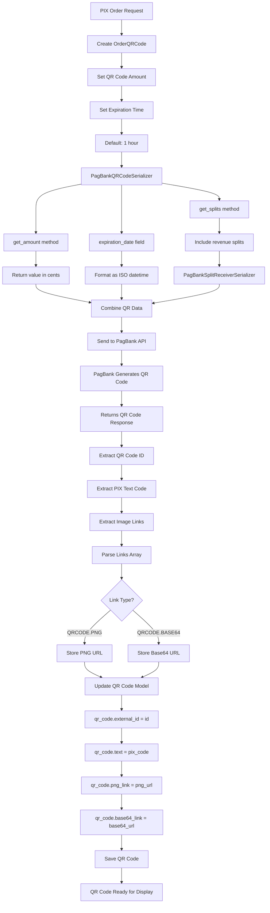
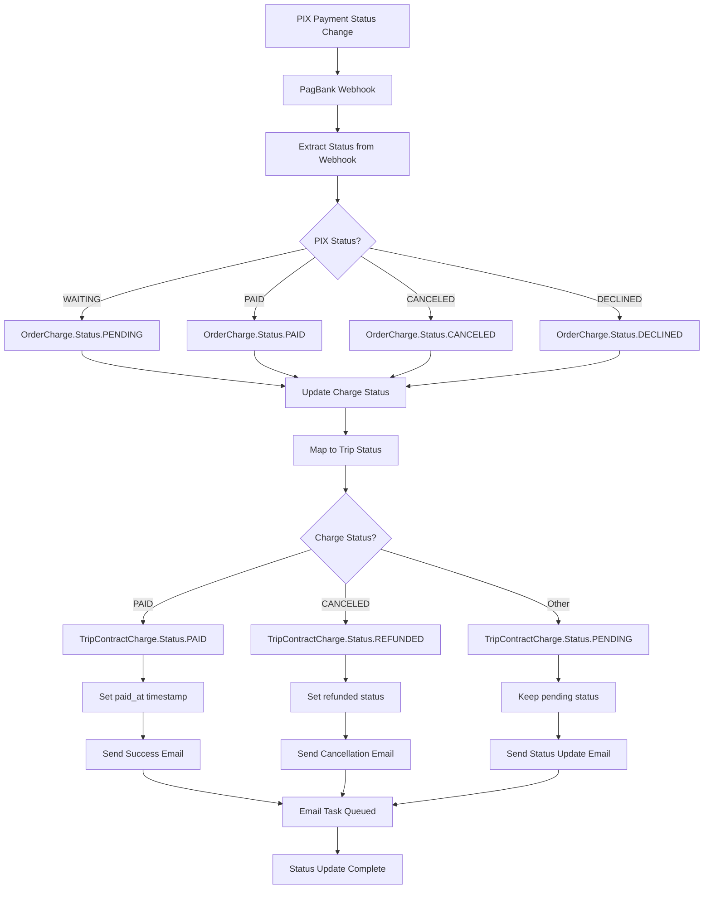
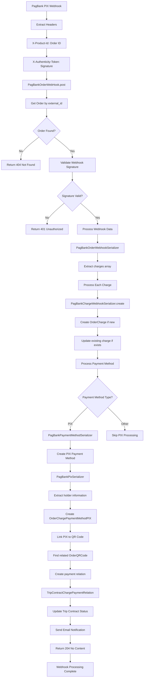
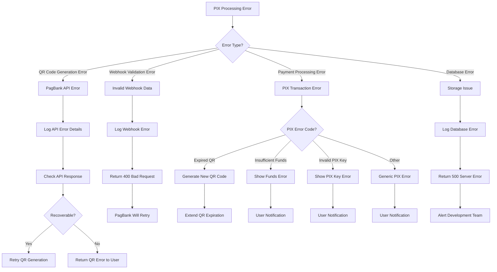
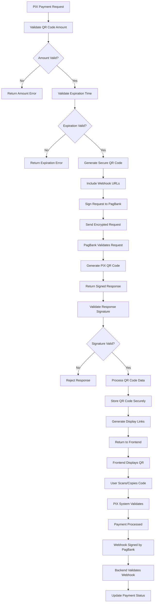

# PagBank PIX Payment Flow

## Overview

This document provides a detailed flowchart specifically for the PIX payment processing in the PagBank integration, focusing on QR code generation, PIX payment method handling, real-time payment processing, and webhook notifications.

## Complete PIX Payment Flow

```mermaid
flowchart TD
    A[User Selects PIX Payment] --> B[Frontend Requests PIX Order]
    B --> C[Backend Payment View/API]
    C --> D[Create Customer Model]
    D --> E[Customer.objects.create]
    
    E --> F[Create Phone Model]
    F --> G[Phone.objects.create]
    
    G --> H[Create Address Model]
    H --> I[Address.objects.create]
    
    I --> J[Create Order Model]
    J --> K[Order.objects.create]
    K --> L[Set payment_gateway = 'PAGBANK']
    
    L --> M[Create OrderItem Model]
    M --> N[OrderItem.objects.create]
    
    N --> O[Create OrderQRCode Model]
    O --> P[OrderQRCode.objects.create]
    P --> Q[Set amount in cents]
    Q --> R[Set expiration time]
    R --> S[Default: 1 hour from now]
    
    S --> T[Create OrderSplit if needed]
    T --> U[OrderSplit.objects.create]
    U --> V[Set revenue split percentages]
    
    V --> W[PagBankClient.create_pix_order]
    W --> X[PagBankPixOrderSerializer.__init__]
    X --> Y[PagBankOrderCustomerSerializer]
    Y --> Z[PagBankOrderCustomerPhoneSerializer]
    Z --> AA[PagBankOrderItemSerializer]
    AA --> BB[PagBankQRCodeSerializer]
    BB --> CC[get_notification_urls method]
    CC --> DD[get_orders_webhook_url]
    
    DD --> EE[Serialize PIX Order Data]
    EE --> FF[Include webhook notification URLs]
    FF --> GG[POST /orders to PagBank API]
    GG --> HH{PagBank API Response?}
    
    HH -->|Error| II[Handle API Error]
    II --> JJ[PaymentGatewayClientRequestFailedError]
    JJ --> KK[Log Error Details]
    KK --> LL[Return Error to Frontend]
    
    HH -->|Success| MM[PagBankPixOrderResponseSerializer]
    MM --> NN[Extract QR Code Response Data]
    NN --> OO[Update Order.external_id]
    OO --> PP[Update OrderQRCode fields]
    
    PP --> QQ[Extract QR Code ID]
    QQ --> RR[qr_code.external_id = response_id]
    RR --> SS[Extract PIX Copy-Paste Text]
    SS --> TT[qr_code.text = pix_code]
    TT --> UU[Extract QR Code Links]
    UU --> VV[Parse PNG and Base64 links]
    VV --> WW[qr_code.png_link = png_url]
    WW --> XX[qr_code.base64_link = base64_url]
    
    XX --> YY[Save QR Code Model]
    YY --> ZZ[Return Success Response]
    ZZ --> AAA[Frontend Receives QR Data]
    
    AAA --> BBB[Display QR Code to User]
    BBB --> CCC[Show PIX Copy-Paste Code]
    CCC --> DDD[Show Payment Instructions]
    DDD --> EEE[User Opens Banking App]
    
    EEE --> FFF{Payment Method?}
    FFF -->|QR Code Scan| GGG[User Scans QR Code]
    FFF -->|Copy-Paste| HHH[User Copies PIX Code]
    
    GGG --> III[Banking App Processes QR]
    HHH --> JJJ[User Pastes in Banking App]
    III --> KKK[Confirm Payment Details]
    JJJ --> KKK
    
    KKK --> LLL[User Confirms Payment]
    LLL --> MMM[Banking System Processes PIX]
    MMM --> NNN[PIX Payment Completed]
    
    NNN --> OOO[PagBank Receives PIX Confirmation]
    OOO --> PPP[PagBank Triggers Webhook]
    PPP --> QQQ[POST /webhooks/orders/]
    QQQ --> RRR[PagBankOrderWebHook.post]
    
    RRR --> SSS{Environment = Production?}
    SSS -->|Yes| TTT[PagBankTokenAuthentication.authenticate]
    SSS -->|No| UUU[Skip Authentication]
    
    TTT --> VVV[Extract X-Authenticity-Token]
    VVV --> WWW[generate_signature]
    WWW --> XXX{Signature Valid?}
    
    XXX -->|No| YYY[AuthenticationFailed]
    YYY --> ZZZ[Return 401 Unauthorized]
    
    XXX -->|Yes| AAAA[Get Order by external_id]
    UUU --> AAAA
    
    AAAA --> BBBB[PagBankClient.update_pix_order]
    BBBB --> CCCC[PagBankOrderWebhookSerializer]
    CCCC --> DDDD[PagBankChargeWebhookSerializer]
    DDDD --> EEEE[PagBankPaymentMethodSerializer]
    EEEE --> FFFF[PagBankPixSerializer]
    
    FFFF --> GGGG[Validate Webhook Data]
    GGGG --> HHHH{Validation OK?}
    HHHH -->|No| IIII[ValidationError]
    IIII --> JJJJ[Return 400 Bad Request]
    
    HHHH -->|Yes| KKKK[Create OrderCharge]
    KKKK --> LLLL[OrderCharge.objects.create]
    LLLL --> MMMM[Set status from webhook]
    MMMM --> NNNN[Set paid_at if PAID]
    
    NNNN --> OOOO[Create OrderChargePaymentMethod]
    OOOO --> PPPP[Set type = 'PIX']
    PPPP --> QQQQ[Create OrderChargePaymentMethodPIX]
    QQQQ --> RRRR[Set holder_name from webhook]
    RRRR --> SSSS[Set holder_document from webhook]
    
    SSSS --> TTTT[Link to Trip Contract Charge]
    TTTT --> UUUU[charge_relation.payment_charge = charge]
    UUUU --> VVVV[Update Trip Status]
    VVVV --> WWWW[trip_charge.status = PAID]
    WWWW --> XXXX[trip_charge.paid_at = timestamp]
    
    XXXX --> YYYY[Send Email Notification]
    YYYY --> ZZZZ[send_email_with_payment_status_update.delay]
    ZZZZ --> AAAAA[Return 204 No Content]
    
    AAAAA --> BBBBB[Frontend Polls for Status]
    BBBBB --> CCCCC[Payment Confirmed]
    CCCCC --> DDDDD[PIX Payment Complete]
```



## PIX QR Code Generation Flow



## PIX Payment Method Processing Flow

```mermaid
flowchart TD
    A[PIX Payment Initiated] --> B[No Payment Method Created Yet]
    B --> C[User Completes PIX Payment]
    C --> D[PagBank Webhook Triggered]
    
    D --> E[Webhook Contains Payment Data]
    E --> F[PagBankChargeWebhookSerializer]
    F --> G[Extract Charge Information]
    
    G --> H[Create OrderCharge]
    H --> I[OrderCharge.objects.create]
    I --> J[Set external_id from webhook]
    J --> K[Set status: PAID/WAITING/etc]
    K --> L[Set amount and currency]
    L --> M[Set paid_at if completed]
    
    M --> N[PagBankPaymentMethodSerializer]
    N --> O[Create OrderChargePaymentMethod]
    O --> P[Set type = 'PIX']
    P --> Q[Link to charge]
    
    Q --> R[PagBankPixSerializer]
    R --> S[Extract PIX holder data]
    S --> T[Create OrderChargePaymentMethodPIX]
    T --> U[Set holder_name]
    U --> V[Set holder_document]
    V --> W[Link to payment_method]
    
    W --> X[Link Payment to QR Code]
    X --> Y[Find OrderQRCode by order]
    Y --> Z[Create TripContractChargePaymentRelation]
    Z --> AA[Link charge to trip contract]
    
    AA --> BB[Payment Method Complete]
```



## PIX Status Update Flow



## PIX Webhook Processing Flow



## PIX Error Handling Flow



## PIX Security and Validation Flow



## Key Components for PIX Processing

### Models
```python
# OrderQRCode - PIX QR code information
class OrderQRCode(models.Model):
    order = models.ForeignKey(Order, related_name='qr_codes')
    external_id = models.CharField(max_length=255)      # PagBank QR ID
    amount = models.IntegerField()                      # Amount in cents
    text = models.TextField()                           # PIX copy-paste code
    png_link = models.URLField()                        # QR PNG image URL
    base64_link = models.URLField()                     # QR Base64 image URL
    expiration = models.DateTimeField()                 # QR expiration time

# OrderChargePaymentMethodPIX - PIX payment details
class OrderChargePaymentMethodPIX(models.Model):
    payment_method = models.OneToOneField(OrderChargePaymentMethod)
    holder_name = models.CharField(max_length=100)      # PIX account holder
    holder_document = models.CharField(max_length=14)   # PIX holder CPF/CNPJ
```

### Serializers
```python
# Request Serialization
class PagBankQRCodeSerializer(serializers.ModelSerializer):
    def get_amount(self, obj: OrderQRCode) -> dict:
        return {"value": obj.amount}
    
    def get_splits(self, obj: OrderQRCode) -> dict:
        return {
            "method": SplitMethods.PERCENTAGE.value,
            "receivers": PagBankSplitReceiverSerializer(
                obj.order.splits.all(), many=True
            ).data,
        }

class PagBankPixOrderSerializer(serializers.ModelSerializer):
    def get_notification_urls(self, _) -> list[str]:
        return [get_orders_webhook_url()]

# Response Deserialization
class PagBankPixOrderResponseSerializer(serializers.ModelSerializer):
    def save(self, **kwargs):
        # Update order external_id
        self.instance.external_id = self.validated_data.get("external_id")
        self.instance.save()
        
        # Process QR codes
        qr_codes = self.validated_data.get("qr_codes", [])
        qr_code = self.instance.qr_codes.first()
        
        # Extract links by type
        links = {link["rel"]: link for link in qr_codes[0]["links"]}
        
        # Update QR code with response data
        qr_code.external_id = qr_codes[0]["id"]
        qr_code.text = qr_codes[0]["text"]
        qr_code.png_link = links[QRCodeLinkTypes.PNG.value]["href"]
        qr_code.base64_link = links[QRCodeLinkTypes.BASE64.value]["href"]
        qr_code.save()

# Webhook Processing
class PagBankPixSerializer(serializers.ModelSerializer):
    def to_internal_value(self, data):
        # Extract holder information from nested structure
        if holder := data.pop("holder", None):
            data["holder_name"] = holder.get("name")
            data["holder_document"] = holder.get("document")
        
        return super().to_internal_value(data)
```

### Client Methods
```python
class PagBankClient:
    def create_pix_order(self, order: Order) -> requests.Response:
        url = f"{self.api_url}{self.ORDER_ENDPOINT}"
        headers = self._get_headers()
        
        # Serialize PIX order with QR codes and webhooks
        serializer = PagBankPixOrderSerializer(order)
        data = serializer.data
        
        # Send to PagBank API
        response = requests.post(url, headers=headers, json=data, timeout=30)
        log_from_requests_response(response)
        response.raise_for_status()
        
        # Process response and update QR code
        serializer = PagBankPixOrderResponseSerializer(order, data=response.json())
        serializer.is_valid(raise_exception=True)
        serializer.save()
        
        return response
    
    def update_pix_order(self, request: Request, order: Order, data: dict) -> DRFResponse:
        # Process webhook data for PIX payments
        serializer = PagBankOrderWebhookSerializer(order, data=data)
        
        try:
            serializer.is_valid(raise_exception=True)
        except ValidationError as err:
            return DRFResponse(err.detail, status=400)
        
        # Save webhook data and update payment status
        serializer.save()
        
        # Link payment to trip contract charges
        charge = order.charges.first()
        if charge and charge.payment_method.type == "PIX":
            # Create payment relation through QR code
            qr_code = order.qr_codes.first()
            if qr_code:
                charge_relation = qr_code.to_trip_contract_charge.first()
                charge_relation.payment_charge = charge
                charge_relation.save()
                
                # Update trip contract status
                trip_charge = charge_relation.trip_contract_charge
                trip_charge.status = TRIP_CHARGE_STATUS_MAPPING[charge.status]
                trip_charge.paid_at = charge.paid_at
                trip_charge.save()
        
        # Send email notification
        send_email_with_payment_status_update.delay(
            charge_pk=charge.pk,
            company_pk=company.pk,
            language="pt_BR",
            email=charge.order.customer.email,
        )
        
        return DRFResponse(status=204)
```

## PIX vs Credit Card Comparison

| Aspect | PIX | Credit Card |
|--------|-----|-------------|
| **Payment Method** | Instant bank transfer | Card processing |
| **QR Code** | Generated for each payment | Not used |
| **Encryption** | Not required (bank-to-bank) | RSA encryption required |
| **Real-time** | Immediate payment | May require authorization |
| **Webhook Timing** | Immediate after payment | May be delayed |
| **Expiration** | QR codes expire (1 hour default) | No expiration |
| **User Experience** | Scan QR or copy-paste code | Enter card details |
| **Security** | Banking app authentication | Card tokenization |

## PIX Data Flow Summary

1. **Order Creation**: User selects PIX → Backend creates order with QR code
2. **QR Generation**: PagBank generates PIX QR code with expiration
3. **Display**: Frontend shows QR code and copy-paste option
4. **Payment**: User completes PIX in banking app
5. **Webhook**: PagBank immediately notifies payment completion
6. **Processing**: Backend creates charge and payment method from webhook
7. **Completion**: Status updated, emails sent, payment confirmed

This comprehensive PIX flow ensures secure, real-time payment processing through Brazil's instant payment system while maintaining full integration with your existing order and trip management systems.